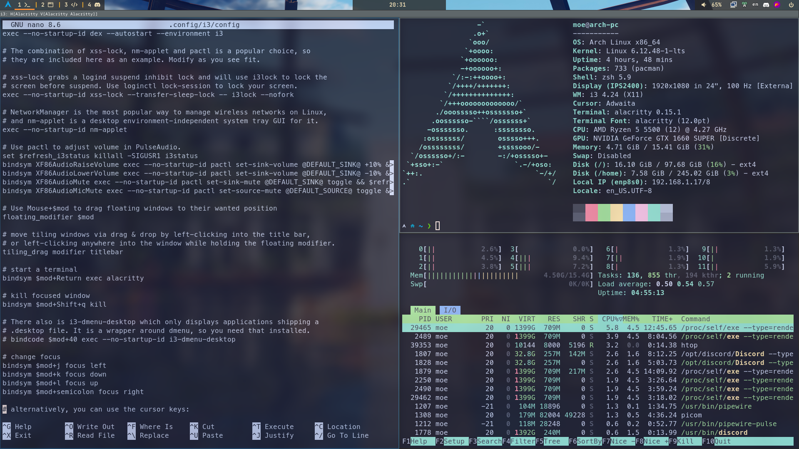
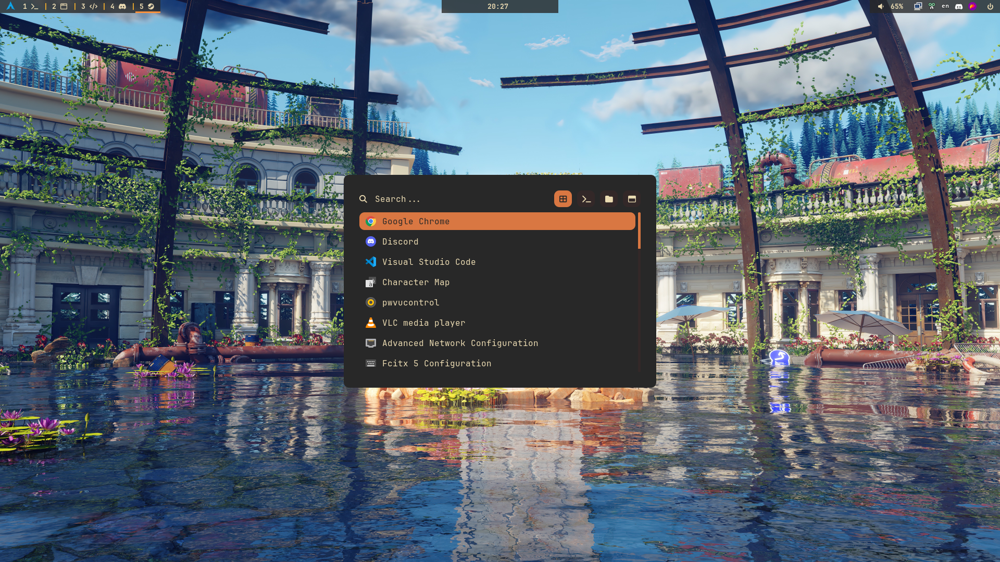
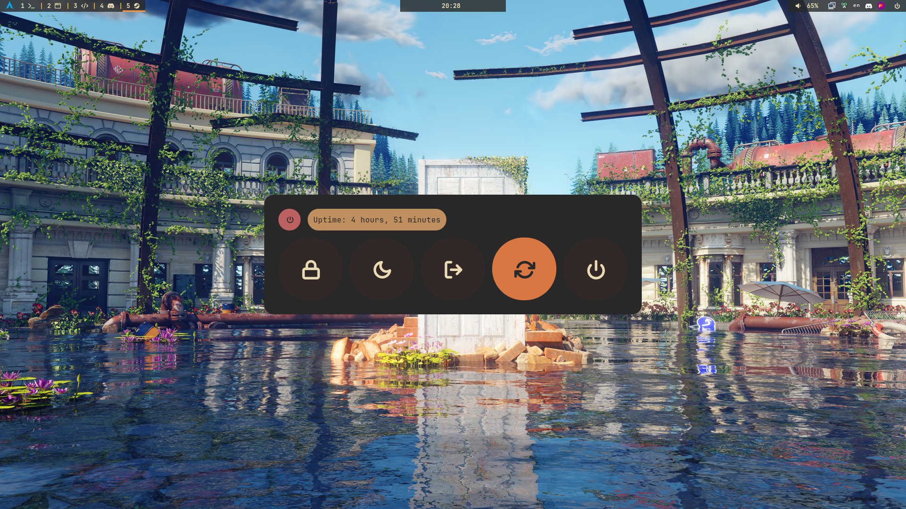
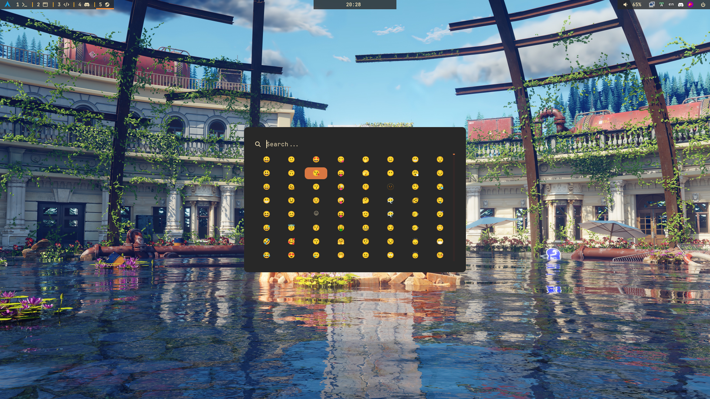

# my dotfiles for Arch Linux (i3wm)

Welcome to my personal dotfiles repository! These configurations are primarily for my Arch Linux setup, featuring the i3 window manager. I aim to keep my environment clean, efficient, and highly personalized.

This repository is managed using `GNU Stow` to create symbolic links, ensuring a tidy home directory while keeping all configurations under version control.

## Table of Contents

* [Features](#features)
* [Screenshots](#screenshots)
* [Prerequisites](#prerequisites)
* [Installation](#installation)
    * [Using the Setup Script](#using-the-setup-script)
* [Included Configurations](#included-configurations)
* [Customization](#customization)
* [Contributing](#contributing)

## Features

* **Package Manager:** `yay` for modern AUR helper.
* **Window Manager:** `i3-wm` for a highly customizable tiling experience.
* **Terminal:** `Alacritty` for a fast, GPU-accelerated terminal.
* **Shell:** `Zsh` with `Oh My Zsh` theme `powerlevel10k` (or a custom prompt/plugins) for an enhanced command-line experience.
* **Status Bar:** `Polybar` for a feature-rich and aesthetic status bar.
* **Application Launcher:** `Rofi` for quick application launching and various utilities, shortcut `Win + D`
* **Emoji picker:** `Rofi-emoji` shortcut `Win + Shift + S`
* **Power Launcher:** shortcut `Win + End`
* **Compositor:** `Picom` for eye candy like shadows and transparency.
* **Credential Management:** Integration with `gnome-keyring` for secure storage of secrets (like GitHub tokens in VS Code).
* **Input Layout:** `Fcitx5-bamboo` for Vietnamese keyboard layout.
* **Screenshot capture:** `Flameshot` shortcut `Win + Print`
* **Clipboard Manager:** `Copyq`
* **Notification:** `Dunst`
* **Audio Controller:** `pwvucontrol` with `pipewire` audio backend.
* **Display Manager:** `gdm`
* **Wallpapers Manager:** `nitrogen`

## Screenshots

*(Here, you would typically add screenshots of your desktop environment. You can remove this section if you don't plan to add screenshots.)*

* **Alacritty:**

* **Rofi Menu:**




## Prerequisites

Before installing, ensure you have the following installed on your Arch Linux system:

* `git`
* `i3wm`

## Installation

### Using the Setup Script

1.  **Clone the repository:**
    ```bash
    git clone https://github.com/quangkhanhdev/.dotfiles.git ~/.dotfiles
    ```

2.  **Navigate into the dotfiles directory:**
    ```bash
    cd ~/.dotfiles
    ```

3.  **Run the installation script:**
    ```bash
    ./install.sh
    ```
    *This script will handle installing `stow` (if not present), creating symlinks for all configurations, and potentially install other core packages. Review the script contents before running it.*

4.  **Update**
    * Reload your i3 configuration (`$mod+Shift+r`) or, preferably, log out and log back in to ensure the keyring starts correctly.

## Included Configurations

This repository contains configurations for the following applications and tools:

* `.gitconfig`: Global Git configuration
* `.config/alacritty/`: Alacritty terminal emulator settings
* `.config/i3/`: i3wm configuration files
* `.config/polybar/`: Polybar status bar setup
* `.config/rofi/`: Rofi launcher configuration files
* `.config/dunst/`: Dunst notification daemon config
* `.config/picom/`: Picom compositor config
* `.config/autostart/`: auto script run at start
* `.config/fcitx5/`: Fcitx5 configuration files
* `.zshrc`: ZSH configuration file
* `.bashrc`: Bash shell configuration file
* `Themes/`: wallpaper folder

## Contributing

If you have suggestions or find issues, feel free to open an issue or pull request.
